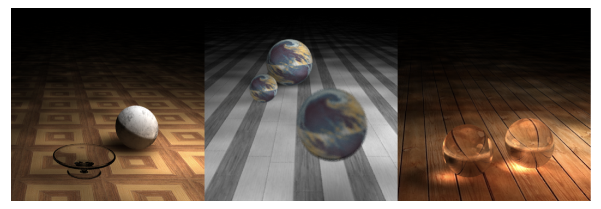

# 使用渐进式光子映射算法进行三维造型与渲染
三维造型与渲染-清华大学计算机科学与技术系计算机图形学课程项目

## 渐进式光子映射算法

在本次实验中，我详细地学习了光线投射（Ray Casting）、光线跟踪（Ray Tracing）、光子映射（Photon Mapping）、渐进式光子映射（Progressive Photon Mapping）以及其升级版 SPPM 等算法，最终实现了 PPM 算法。

在 PM 算法中，全局光照 = 直接光照 + 间接光照。从光源向场景发射光子，并在它们碰到漫反射物体时将他们保存在一个光子图中。由于其“光子”的算法特性，可以很好的渲染出由间接光照所造成的“辉映”和“焦散”等效果，这是光线追踪算法所不能达到的。

之所以能形成间接光照，是因为光子在处理漫反射时，按照Cos的概率分布随机选取一个方向继续传播，而且光子衰减也采用了特殊处理，即按物体材质反射、折射、漫反射还有被吸收的比例随机选择一种。

在 PM 算法中，使用 KDTree 组织光子图，在光子图被组织好以后，对场景进行一次光线追踪。再遇到漫反射的物体时，不直接通过光源计算色光，而是通过光子图来估算。以碰撞点为球心，找到最小的包含 K 个光子的球， 其半径为 R 。该碰撞点的漫反射亮度应与 R 的平方成反比。再将这 K 个光子类比成光源，结合 Phong 模型计算这些光子赋予碰撞点的平均色光，在除以 PiR^2 ，即可得到这次漫反射所要返回的颜色值。

在 PM 算法中，通过估算漫反射时获得的色光，光子图越大，估算越精确。然而计算机内存大小有限，渲染不能做到任意精确，PPM 解决了这一问题。

在 PPM 算法中，反转了 Photon Tracing 和 Ray Tracing 的顺序。首先将 Ray Tracing 时检测到的碰撞点组织成一棵 KDTree ，而后一轮轮的发射光子，每一轮的光子半径减小、能量减小，每一轮渲染一张图片。随着轮数的增多，光子数量越来越多，半径越来越小，最终结果也越来越精确，这样 PPM 算法也使得光子映射能够形成任意精准度的图片，只要时间允许。

在 SPPM 算法中，只是在每一轮光子映射前重新进行了一次 Ray Tracing ，并加以微小的扰动，以获取更优质的渲染结果。因为时间的原因，我没有再进行算法的升级，仅实现了 PPM 算法

## 参数曲面求交

如图所示，其中玻璃质地的碗为六条四阶贝塞尔曲线经 Z 轴旋转而形成。这个旋转体曲面即为待渲染的参数曲面。

在实验中，我试用了牛顿迭代法进行了参数曲面与光线求交。

具体计算过程详见PDF文件。

## 算法型加速

在实验中 PPM 算法组织视点形成基于维度分割 KDTree 结构可以大大提升算法效率。KD树建树期间，按照指定维度分割出较小的一半和较大的一半。KD树通过对子树维护视点集包围盒，实现快速判断一个询问点是否在包围盒中。
包围盒用 maxX , minX , maxY , minY , maxZ , minZ 定义，询问点 ( X , Y , Z ) ：
dx = max(0,|X-maxX|,|X-minX|),
dy = max(0,|Y-maxY|,|Y-minY|),
dz = max(0,|Z-maxZ|,|Z-minZ|)
答案dist满足：dist = \sqrt{dx^2+dy^2+dz^2}

## OpenMP的使用

为了加快渲染速度，实验中使用了 OpenMP 进行多线程渲染。

## 景深效果

普通的相机模型中，有一个人眼位置和一个屏幕，对于屏幕中每一个像素，连接人眼和该像素位置得到一条射出光线。

首先，已知屏幕像素坐标，以及屏幕本身在场景中的位置，我们可以计算出该像素的位置，如图中红点所述。接着，连接人眼和像素的光线就可以用于计算该光线的颜色。在普通相机模型的屏幕和人眼位置之外，带景深的相机模型额外存在一个焦平面。

通过普通的相机模型，我们可以求得普通相机的光线的方向。

普通相机的光线一定会和焦平面在某个位置碰撞，为了达到景深效果，一方面，我们需要保证同一个像素对应的光线一定会击打到焦平面上的同一个点，另一方面，在焦平面之外的其他位置，同一个像素对应的光线应该击打到不同的点。

我们对光线的起始位置做一个微小扰动，并且修改光线方向使得光线恒定过焦平面上的点。这样，无论初始光线如何扰动，焦平面上的点都可以最清晰的表现出来。而不在焦平面上的点，会产生随机的模糊效果。

## 贴图效果

在实验中，我分别将地板和部分球体进行了贴图。

